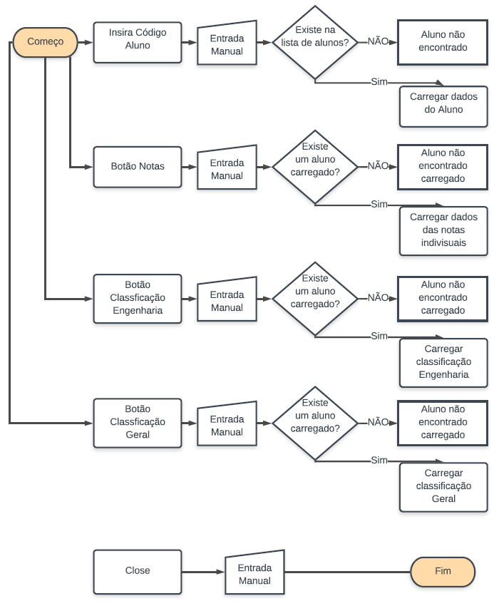
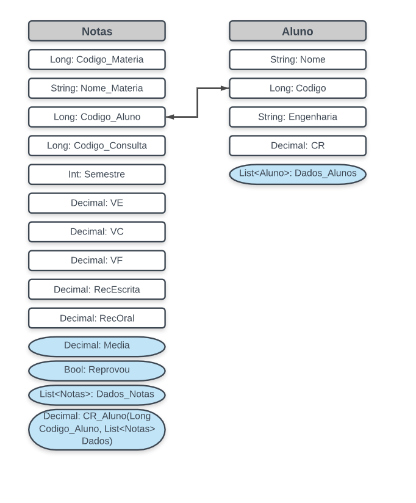
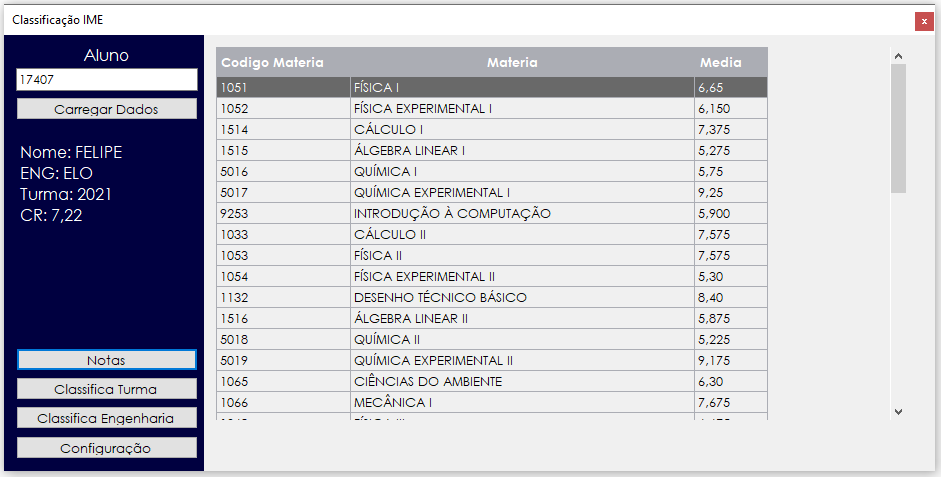
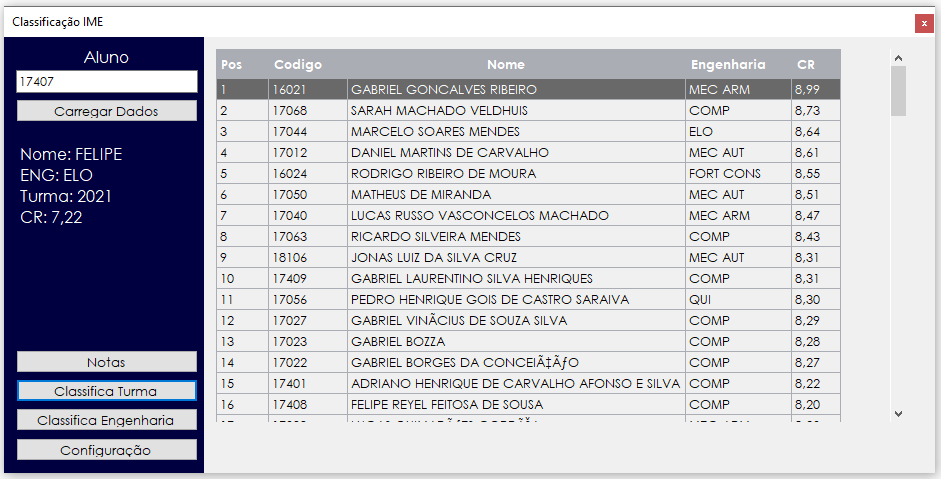
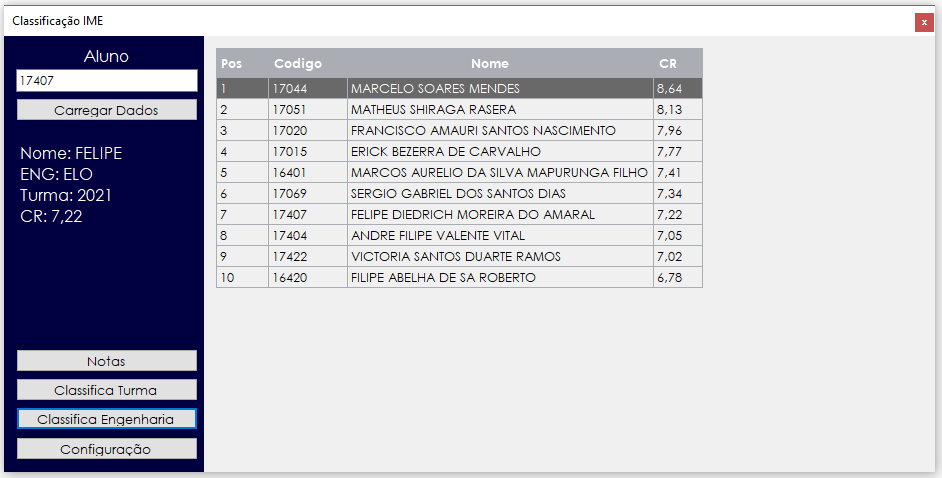
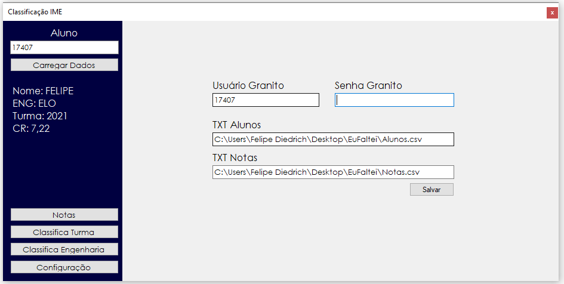

## Descrição:
Sistema de Notas e Classificação para alunos do IME.
Consiste em um programa desktop, que visa facilidar a visualização de notas e classficação.

## Função:
 - Fazer webscraping do granito
 - Mostrar médias por matéria
 - Visão geral do aluno
 - Classificação por turma
 - Classificação por engenharia
 - Armazenar os dados do granito em .CSVs, obtendo os dados através de requests http

## Motivação:
O Granito não disponibiliza um acompanhamento de classificação para os alunos, e é necessário estar no IME para consultar qualquer registro.
O programa visa criar registros individuais que podem ser atualizados quando o aluno está no IME, assim como ver sua classficação.

### Fluxograma:

### Diagra de Classes:

### GUI:

### Notas Individuais:

### Classificação Turma:

### Classificação Engenharia:

### Configuração:

### Documentação:

Programa será desenvolvido utilizando o Visual Studio em linguagem C#. Webscraping em Python (usando requests e pandas).
Para compilar o projeto é possivel installar o mesmo no computador, ou então rodar o projeto Sistema_Alunos.Sln no Visual Studio Community 2017.

Para o dowload de dados, é necessário rodar o script webscraping.py. 

Observação: O processo de obtenção de dados está sendo feito em Python devido a praticidade de extrair tabelas de paginas html com o pandas, em uma proxima versão a obenção de dados também será feito pelo c#.
